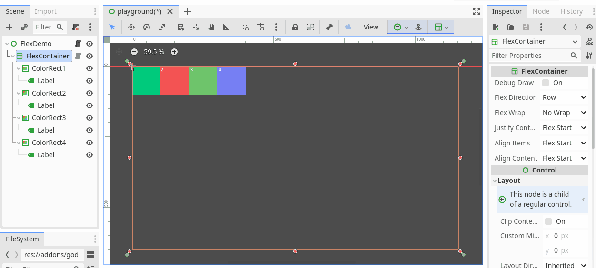

# Godot Flexbox layout 

 

Flexbox layout for Godot Engine

## WIP 🧑‍💻
✔️Godot 3.x (3.5 tested)
This is a work in progress. it can be used basically, and test worked windows and android.

### Learn what flexbox is
- [A Complete Guide to Flexbox](https://css-tricks.com/snippets/css/a-guide-to-flexbox/)
- [Flexbox Froggy](https://flexboxfroggy.com/)

## Getting Started
### Installation
- get the latest release from the godot asset library [here](https://godotengine.org/asset-library/asset/1648)
- clone the repo and copy the `addons` folder into your project

### Usage
- Add the `FlexContainer` node to your scene

- Change the `FlexDirection` property in inspector, and you can see the layout changed, also you can change the child properties in child inspector

*dark theme only for child inspector*

## Todo
- [ ] Godot 4.x support
- [ ] More properties
- [ ] More Platforms(WebAssembly)

## License

